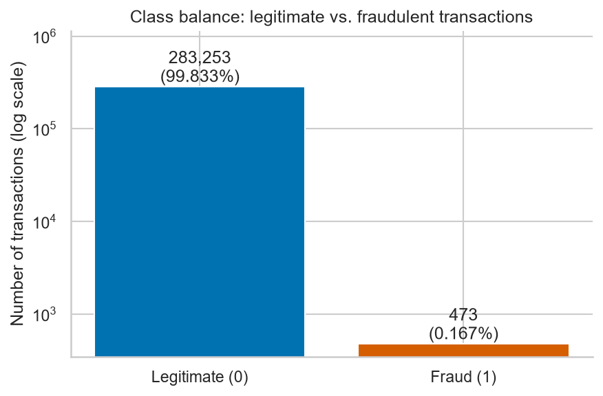
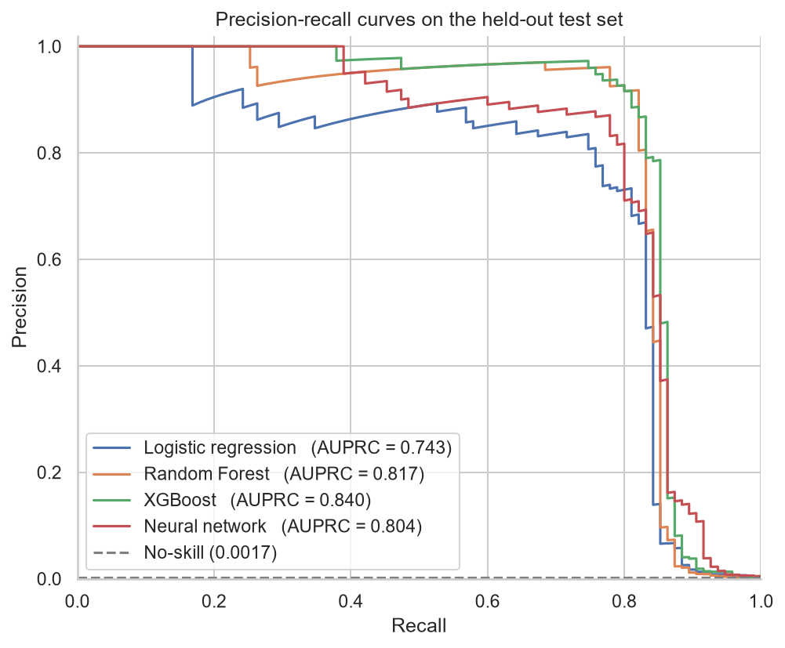
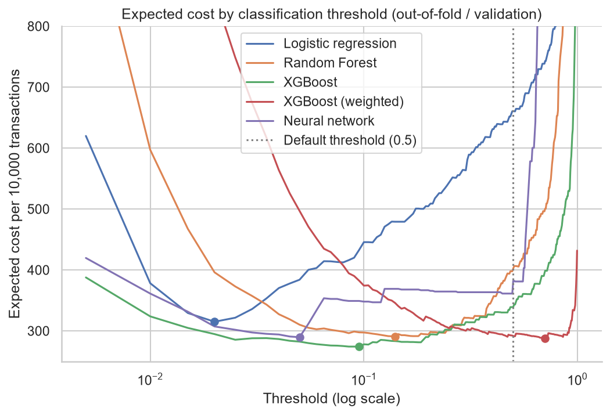

# Credit Card Fraud Detection

Card fraud is rare: in this dataset, about 1 transaction in 600 is fraudulent. This project compares logistic regression, a Random Forest, XGBoost and a Keras neural network, judged on metrics suited to extreme imbalance and on the expected cost of each type of error. The recommended model is **XGBoost with a decision threshold of 0.095**, which catches **78 of 95 test frauds (82%) with 11 false alarms** and cuts expected cost from 2,225 at the default threshold to 1,755. The full analysis is in the [notebook](notebooks/credit_card_fraud_detection.ipynb).

## Key Results

| Model | AUPRC | Expected cost at 0.5 | Expected cost at tuned threshold |
| :--- | ---: | ---: | ---: |
| Logistic regression | 0.743 | 4,435 | 1,845 |
| Random Forest | 0.817 | 2,115 | 1,700 |
| **XGBoost (recommended)** | **0.840** | 2,225 | **1,755** |
| Neural network | 0.804 | 2,155 | 1,960 |
| XGBoost (class-weighted) | 0.835 | 1,790 | 1,785 |

Expected cost counts each missed fraud as 100 and each false alarm as 5, summed over the 56,746 test transactions.

The Random Forest has the lowest tuned cost, but its lead over XGBoost comes down to a single fraud on the test set. XGBoost was chosen on the larger out-of-fold evidence from the training data, as explained in [Recommendation](#recommendation).

## The Problem and the Data

**The problem.** Card fraud is so rare that a model labelling every transaction as legitimate scores 99.8% accuracy while catching no fraud at all. The two kinds of error also cost very different amounts. A missed fraud is money lost, while a false alarm blocks a genuine customer.

**The data.** The [Credit Card Fraud Detection dataset](https://www.kaggle.com/datasets/mlg-ulb/creditcardfraud) on Kaggle contains two days of European card transactions from September 2013.

- **Raw:** 284,807 transactions, of which 492 are fraud (0.172%).
- **After removing 1,081 duplicate rows:** 283,726 transactions, of which 473 are fraud (0.167%).
- **Features:** `Time`, `Amount`, and `V1` to `V28`. The `V` columns are PCA components, anonymised for confidentiality, so the model's decisions cannot be explained in terms of real-world attributes.



## Approach

1. **Split.** The data was split 80:20, stratified on the fraud label so both sets keep the same fraud rate. The test set holds 95 frauds.
2. **Preprocessing.** `Time` and `Amount` are scaled inside a scikit-learn pipeline, so the scaler is only ever fitted on training data.
3. **Models.** Logistic regression set the baseline. A Random Forest and XGBoost were tuned with 5-fold cross-validation, ranked by AUPRC. A small Keras neural network was trained with early stopping on validation AUPRC.
4. **Class imbalance.** Class weighting was tested as a controlled comparison: the tuned XGBoost model with and without `scale_pos_weight`.
5. **Threshold tuning.** Each model's decision threshold was chosen to minimise expected cost on out-of-fold training scores, then applied once to the test set.

## Findings

**No model wins on every metric.** Four different models come top on at least one of precision, recall, F1, AUPRC, ROC-AUC and expected cost. Every non-linear model clearly beats the logistic baseline, which misses 44 frauds at the default threshold against 16 to 22 for the others.

**ROC-AUC can mislead at this imbalance.** The neural network has the highest ROC-AUC of the four models (0.983) but only the third-best AUPRC (0.804). ROC-AUC divides false alarms by the 56,651 legitimate test transactions, a number large enough to hide them. AUPRC does not, so it was used to rank models.

**Every model hits a recall ceiling near 85%.** All four precision-recall curves collapse at the same point, and the three non-linear models share 18 of their 21 to 22 missed frauds. The limit comes largely from the features rather than the algorithms.



**Class weighting mainly moves the threshold.** Weighting XGBoost caught 6 more frauds and raised 33 more false alarms at the default threshold, lowering expected cost. Its AUPRC barely changed, and once thresholds were tuned it gave no benefit.

**The threshold mattered more than the model.** Tuning the threshold saved 415 to 470 for the tree models, while the three best tuned models finished only 85 apart. XGBoost's cost curve also has the widest flat region, so its threshold is the least sensitive to small shifts in the data.



## Recommendation

**Deploy XGBoost with a decision threshold of 0.095.**

- **Expected cost was the deciding metric.** A missed fraud costs 20 times as much as a false alarm, which accuracy and F1 ignore and AUPRC does not turn into a threshold.
- **It had the lowest out-of-fold cost**, 274.0 per 10,000 transactions against 290.6 for the Random Forest, measured on 378 training frauds.
- **It has the most robust threshold**, with the widest flat region on the cost curve.
- **It raises the fewest false alarms** among the closely matched models: 11, against 17 for weighted XGBoost and 20 for the Random Forest. That matters for customer frustration, which the cost matrix does not capture.

In practice, about 82 of every 100 frauds would be blocked, and about 1 in 8 blocked transactions would belong to a genuine customer.

The Random Forest is a close, defensible alternative. The full reasoning is in the notebook's Business Recommendation section.

## Limitations

- **The threshold must travel with the model.** A plain scikit-learn pipeline's `predict()` always uses 0.5. The saved model wraps the pipeline in `FixedThresholdClassifier`, so its `predict()` applies 0.095. If the model is retrained, the threshold should be re-chosen.
- **The cost matrix is an assumption.** If a false alarm costs more than 5, the threshold should be re-chosen with the same method.
- **The data is old and anonymised.** It covers two days from 2013, and fraud patterns drift, so the model should be re-validated on recent data.
- **The test evidence is limited.** The test set holds only 95 frauds and was used repeatedly during the analysis, so small gaps between models are not conclusive.

## Project Structure

```
├── notebooks/
│   └── credit_card_fraud_detection.ipynb   # Full analysis and write-up
├── src/credit_fraud_pack/
│   ├── config.py                           # Seed, split size, paths, cost matrix
│   ├── data.py                             # Dataset download and loading
│   ├── pipeline.py                         # Shared preprocessing pipeline
│   ├── evaluate.py                         # Metrics, plots, comparison tables
│   └── train.py                            # Fits and saves the final model
├── tests/                                  # Unit tests on small synthetic data
├── outputs/
│   ├── figures/                            # Charts used in this README
│   └── model_comparison.csv                # Model comparison table
├── data/raw/                               # Downloaded dataset (not committed)
├── models/                                 # Saved model (not committed)
├── pyproject.toml
└── LICENSE
```

## How to Run

Requires Python 3.11, 3.12 or 3.13. TensorFlow, used for the neural network, does not yet support Python 3.14.

**1. Install the package and its dependencies.**

```bash
git clone https://github.com/Linamandla-Mzamane/Credit-Card-Fraud-Detection.git
cd Credit-Card-Fraud-Detection
python -m venv .venv
source .venv/bin/activate      # On Windows: .venv\Scripts\activate
pip install -e ".[notebook,dev]"
```

**2. Download the dataset.** This needs a Kaggle account and API token, either as a `kaggle.json` file or the `KAGGLE_USERNAME` and `KAGGLE_KEY` environment variables.

```bash
python -c "from credit_fraud_pack.data import download_dataset; download_dataset()"
```

**3. Run the notebook**, or train and save the final model directly:

```bash
python -m credit_fraud_pack.train
```

This prints the test-set results and saves the model to `models/xgboost_fraud_model.joblib`.

**4. Run the tests.** They use small synthetic data, so they don't need the dataset.

```bash
pytest
```

## Tools

Python, pandas, NumPy, scikit-learn, XGBoost, TensorFlow and Keras, Matplotlib, seaborn, kagglehub, joblib, pytest

## License

This project is licensed under the MIT License. See [LICENSE](LICENSE).
